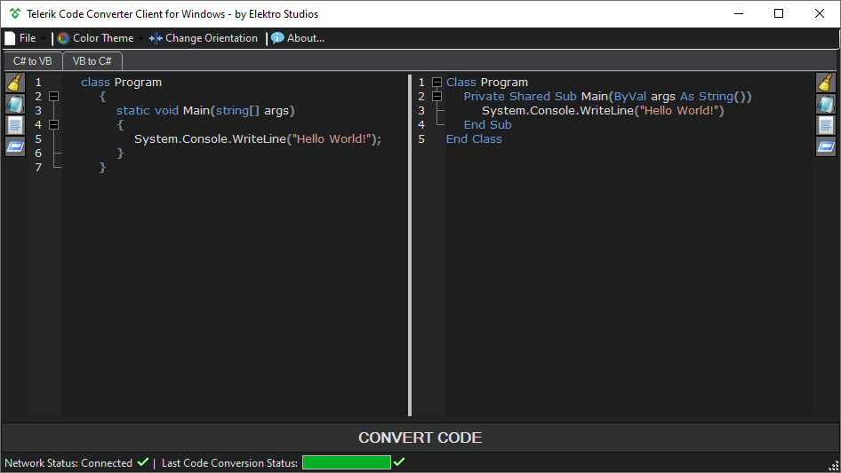
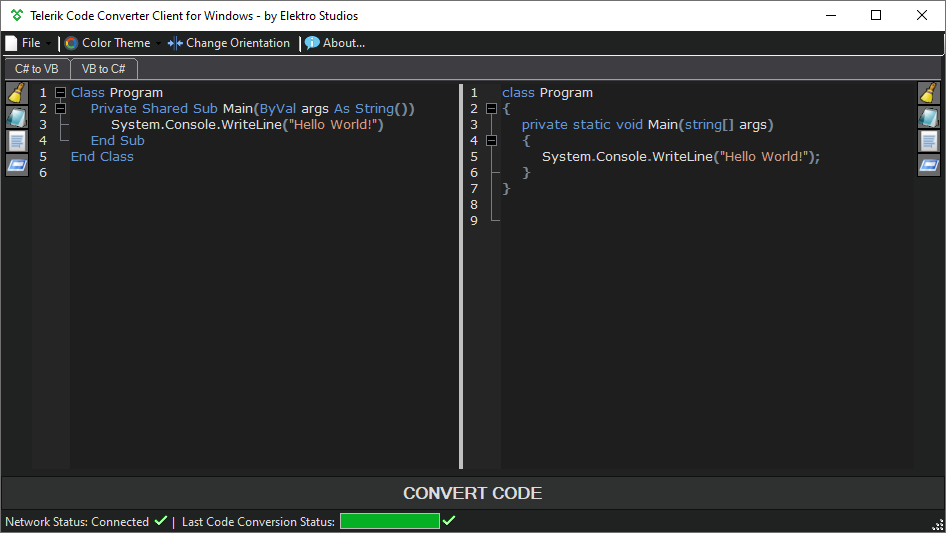
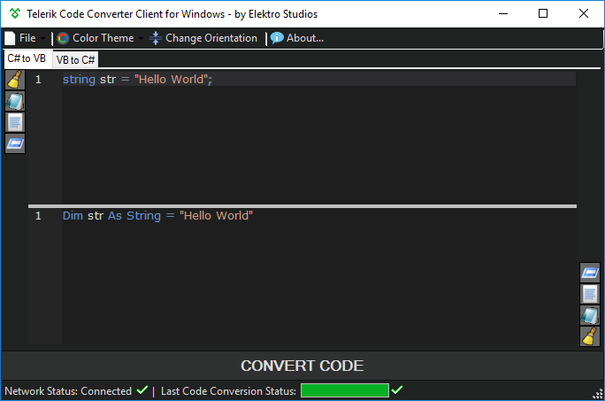
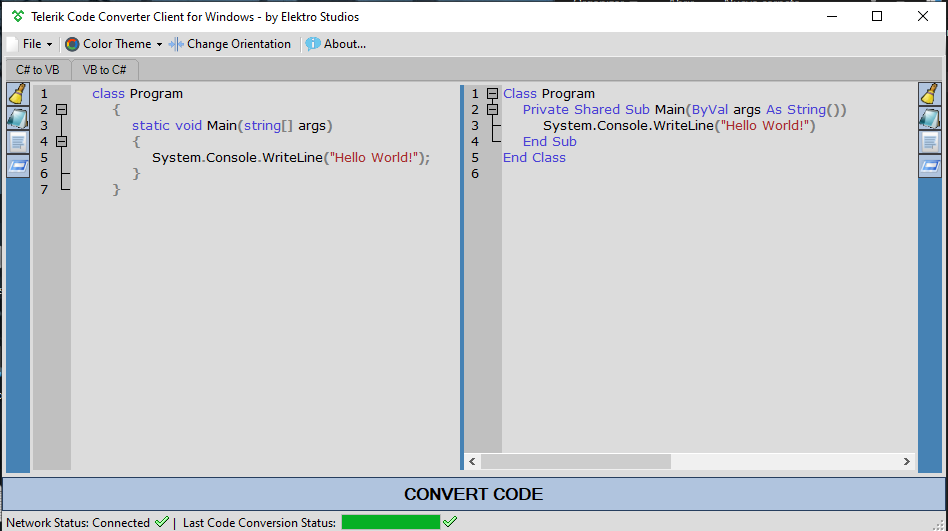
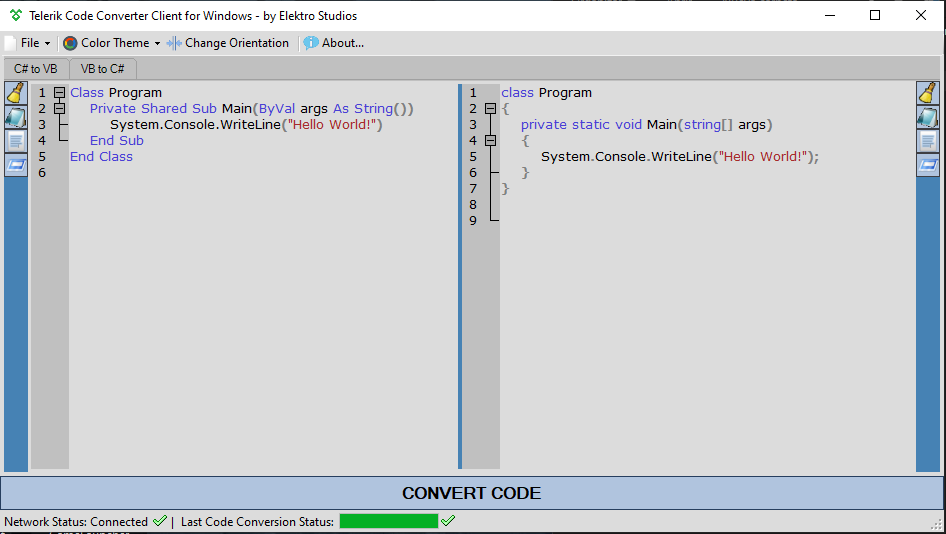
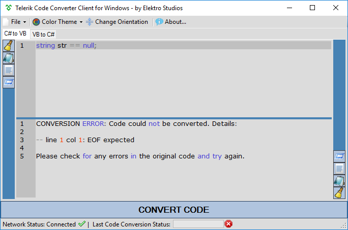

<!-- Common Project Tags:
desktop-app 
desktop-application 
dotnet 
dotnet-core 
netcore 
netframework 
netframework48 
tool 
tools 
vbnet 
visualstudio 
windows 
windows-app 
windows-application 
windows-applications 
windows-forms 
winforms 
 -->

  
  
  <h1>Telerik Code Converter Desktop Client for Windows</h1>

### Desktop application to convert code between C#<>VB using [Telerik Code Converter web service](https://converter.telerik.com/).

Also available as a Visual Studio extension [here](https://github.com/ElektroStudios/Telerik-Code-Converter-for-Visual-Studio).

------------------

    &nbsp;
    &nbsp;
    &nbsp;
    
    &nbsp;
    
   
   
    
    
    
    
    
    
   
    
    
    
    
    
    
   
   
    

------------------

## 👋 Introduction

**Telerik Code Converter Desktop Client** is an independent Windows utility that provides a dedicated graphical interface to seamlessly convert source code between C# and VB.NET. By leveraging the public [Telerik Code Converter web service](https://converter.telerik.com/), this tool acts as a lightweight desktop wrapper featuring syntax highlighting, tabbed navigation, and quick clipboard actions.

> [!IMPORTANT]
> This project is a non-commercial, third-party client tool. It is not affiliated with, authorized, or sponsored by Progress Telerik.

## 💡 Motivation

While the official web-based converter works great for occasional snippets, constantly switching to a web browser, pasting code, selecting languages, and copying the results back to your IDE becomes tedious during heavy migration tasks. 

This client was built to streamline that workflow. By packaging the converter into a responsive desktop application powered by Scintilla.NET, you get a dedicated environment tailored for quick code transformations, side-by-side comparisons, and offline-like workspace handling without leaving your desktop environment.

##### ⚡ The Real Question
###### Why disrupt your development flow by constantly bouncing between your IDE and a web browser just to convert single blocks of code?.

## 🖼️ Screenshots

### ☀️ Light Theme

  
  

  

---

### 🌙 Dark Theme

  
  

  

## 📝 Requirements

- Microsoft Windows OS.
- A network connection.

## 🚀 Getting Started

1. Navigate to the **[Releases page](https://github.com/ElektroStudios/Telerik-Code-Converter-Client-For-Windows/releases/latest)**.
2. Download the latest `.zip` archive and extract its contents to your preferred directory.
3. Run the executable file to launch the application.

## 🔄 Change Log

Explore the complete list of changes, bug fixes, and improvements across different releases by clicking [here](/Docs/CHANGELOG.md).

## 💪 Contributing

Your contribution is highly appreciated!. If you have any ideas, suggestions, or encounter issues, feel free to open an issue by clicking [here](https://github.com/ElektroStudios/Telerik-Code-Converter-Client-For-Windows/issues/new/choose). 

Your input helps make this Work better for everyone. Thank you for your support! 🚀

## 💰 Beyond Contribution

This project is distributed for educational purposes and without any profit motive. However, if you find value in my individual efforts and wish to support my ongoing work, you may consider contributing financially through the following options:

| Platform | How to Support |
| :---: | :--- |
|  | **[Become my sponsor on GitHub](https://github.com/sponsors/ElektroStudios/)** Contribute any amount you prefer and unlock rewards! |
|  | **[Support me on Ko-fi](https://ko-fi.com/elektrostudios)** Buy me a coffee! |
|  | **[Become a Patron on Patreon](https://www.patreon.com/c/elektrostudios/membership)** Support my open-source work regularly! |
|  | **[Make a PayPal Donation](https://www.paypal.com/cgi-bin/webscr?cmd=_s-xclick&hosted_button_id=E4RQEV6YF5NZY)** Donate any amount you like via PayPal! |
|  | **[Purchase my software at Envato's CodeCanyon](https://codecanyon.net/item/elektrokit-class-library-for-net/19260282)** Discover my desktop tools and **DevCase Class Library for .NET**, an extensive API suite. |

 

  <b>Your support means the world to me! Thank you for considering it! 🤗💗</b>

------------------

## 🏆 Credits

This work relies on the following technologies, services and libraries: 

 - [.NET Framework](https://dotnet.microsoft.com/en-us/download/dotnet-framework)
 - [Telerik Code Converter](https://converter.telerik.com/)
 - [Json.NET](https://www.newtonsoft.com/json)
 - [Scintilla.NET](https://github.com/jacobslusser/ScintillaNET)
 - [A .NET Flat TabControl (CustomDraw)](https://web.archive.org/web/20250217152846/https://www.codeproject.com/Articles/12185/A-NET-Flat-TabControl-CustomDraw)

## ⚠️ Disclaimer

### Trademark Notice
All product names, logos, brands, and trademarks (including "Telerik" and "Progress Telerik") are property of their respective owners. All company, product, and service names used in this repository are for identification and compatibility purposes only. The use of these names, logos, and brands does not imply endorsement or affiliation.

This Work has no affiliation, approval or endorsement by [Telerik](https://www.telerik.com/) company.

---

This software and its associated repository are provided strictly on an "as is" basis, without warranties of any kind, whether express or implied. This includes, but is not limited to, any implied warranties of merchantability, reliability, or fitness for a particular purpose.

The authors and copyright holders assume no liability for any direct, indirect, incidental, or consequential damages—including data loss or system errors—arising from the use, misuse, or inability to use this software. You are solely responsible for determining the appropriateness of using this tool and assume all associated risks.

Furthermore, this project operates entirely independently. The utilization of any third-party libraries or components within this software does not imply any affiliation with, or endorsement or approval by, their respective original authors.

This software may interact with third-party services, websites, or platforms. It is the user's sole responsibility to ensure that such use complies with the applicable terms of service, laws, and regulations. The authors do not endorse, and are not responsible for, any misuse of this software to violate third-party terms of service or applicable law.

By using this software, you agree to indemnify and hold harmless the authors from any claims, damages, or liabilities arising from your use or misuse of it.

This project is licensed under the **Apache License, Version 2.0**. See the  [License](./LICENSE) file for details.
